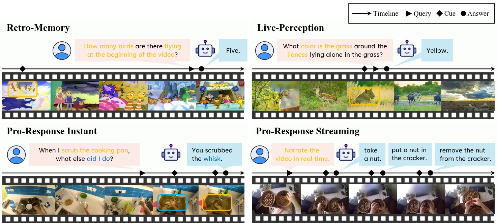

<div align="center">

<h2>
    RIVER: A Real-Time Interaction Benchmark for Video LLMs
</h2>


[Yansong Shi<sup>*</sup>](https://scholar.google.com/citations?user=R7J57vQAAAAJ), 
[Qingsong Zhao<sup>*</sup>](https://scholar.google.com/citations?user=ux-dlywAAAAJ), 
[Tianxiang Jiang<sup>*</sup>](https://github.com/Arsiuuu), 
[Xiangyu Zeng](https://scholar.google.com/citations?user=jS13DXkAAAAJ&hl), 
[Yi Wang](https://scholar.google.com/citations?user=Xm2M8UwAAAAJ), 
[Limin Wang<sup>†</sup>](https://scholar.google.com/citations?user=HEuN8PcAAAAJ)  
[[💻 GitHub]](https://github.com/OpenGVLab/RIVER), 
[[🤗 Dataset on HF]](https://huggingface.co/datasets/nanamma/RIVER), 
[[📄 ArXiv]](https://arxiv.org/abs/2603.03985)
</div>


## Introduction
This project introduces **RIVER Bench**, designed to evaluate the real-time interactive capabilities of Video Large Language Models through streaming video perception, featuring novel tasks for memory, live-perception, and proactive response.



Based on the frequency and timing of reference events, questions, and answers, we further categorize online interaction tasks into four distinct subclasses, as visually depicted in the figure. For the Retro-Memory, the clue is drawn from the past; for the live-Perception, it comes from the present—both demand an immediate response. For the Pro-Response task, Video LLMs need to wait until the corresponding clue appears and then respond as quickly as possible.

## Dataset Preparation
|Dataset       |URL|
|--------------|---|
|LongVideoBench|https://github.com/longvideobench/LongVideoBench|
|Vript-RR      |https://github.com/mutonix/Vript|
|LVBench       |https://github.com/zai-org/LVBench|
|Ego4D         |https://github.com/facebookresearch/Ego4d|
|QVHighlights  |https://github.com/jayleicn/moment_detr|

## Citation

If you find this project useful in your research, please consider cite:
```BibTeX
@misc{shi2026riverrealtimeinteractionbenchmark,
      title={RIVER: A Real-Time Interaction Benchmark for Video LLMs}, 
      author={Yansong Shi and Qingsong Zhao and Tianxiang Jiang and Xiangyu Zeng and Yi Wang and Limin Wang},
      year={2026},
      eprint={2603.03985},
      archivePrefix={arXiv},
      primaryClass={cs.CV},
      url={https://arxiv.org/abs/2603.03985}, 
}
```
